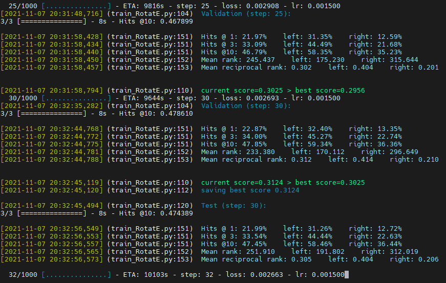

<h1 align="center">知识图谱工具箱</h1>

*
简单快速、强力辅助.
*

 

  
  

 

设计哲学

1. 这不是库，而是工具箱——所以`不需要安装`
2. 工具都应该`简短`——所以每个函数不超过 10 行，工具类最多继承 1 层
3. 傻瓜用户也能用——所以`注释详尽`
4. 专为实验而生——所以`基础设施完善`

## Quick start

直接将 `toolbox` 文件夹复制到你的项目下即可。

或者以本项目为模板，创建新 github repo 开始新项目。

## Feature

1. PyTorch 友好
    1. toolbox 下也有 nn、nn.functional、optim 等目录，功能和 PyTorch 完全一样
2. 命令行参数解析
3. 输入输出目录管理
    1. 日志、可视化文件、模型保存目录、数据读取目录、数据预处理缓存目录
4. 进度条
5. 随机种子
6. TensorBoard 监控
7. 超参数自动搜索 AutoML
8. 梯度累加（应对小内存 gpu 对 batch_size 的限制）
9. 中断训练、恢复训练
2. 知识图谱嵌入领域专用工具
    1. 嵌入降维可视化
    2. 数据集、常用数据预处理
    3. 链接预测任务、实体对齐任务（自动生成对应的数据集并训练）
    4. 测试指标（Hit@k、MR、MMR、AUC）
    5. 经典 KGE 模型的 PyTorch 版复现
    6. 经典 KGE 模型在注释中写明引用bib、pdf下载路径、原开源实现地址等

## Paper & Result

TODO `(h,r,?)` 和 `(?,r^{-1},t)` 不一样，下面的是平均结果。

有的论文只给 `(h,r,?)` 的结果，导致结果偏高，很坑。

#### FB15K-237 (Freebase)

|                                                                                                                                  |   MRR | Hits@1 | Hits@3 | Hits@10 |
| -------------------------------------------------------------------------------------------------------------------------------- | ----: | :----: | :----: | :-----: |
| [RESCAL](http://www.icml-2011.org/papers/438_icmlpaper.pdf)                                                                      | 0.356 | 0.263  | 0.393  |  0.541  |
| [TransE](https://papers.nips.cc/paper/5071-translating-embeddings-for-modeling-multi-relational-data)                            | 0.313 | 0.221  | 0.347  |  0.497  |
| [DistMult](https://www.microsoft.com/en-us/research/wp-content/uploads/2016/02/ICLR2015_updated.pdf)                             | 0.343 | 0.250  | 0.378  |  0.531  |
| [ComplEx](http://proceedings.mlr.press/v48/trouillon16.pdf)                                                                      | 0.348 | 0.253  | 0.384  |  0.536  |
| [ConvE](https://arxiv.org/abs/1707.01476)                                                                                        | 0.339 | 0.248  | 0.369  |  0.521  |
| [RotatE](https://openreview.net/pdf?id=HkgEQnRqYQ) [code](https://github.com/DeepGraphLearning/KnowledgeGraphEmbedding) | 0.333 | 0.240  | 0.368  |  0.522  |

#### WN18RR (Wordnet)

|                                                                                                       |   MRR | Hits@1 | Hits@3 | Hits@10 |
| ----------------------------------------------------------------------------------------------------- | ----: | :----: | :----: | :-----: |
| [RESCAL](http://www.icml-2011.org/papers/438_icmlpaper.pdf)                                           | 0.467 | 0.439  | 0.480  |  0.517  |
| [TransE](https://papers.nips.cc/paper/5071-translating-embeddings-for-modeling-multi-relational-data) | 0.228 | 0.053  | 0.368  |  0.520  |
| [DistMult](https://www.microsoft.com/en-us/research/wp-content/uploads/2016/02/ICLR2015_updated.pdf)  | 0.452 | 0.413  | 0.466  |  0.530  |
| [ComplEx](http://proceedings.mlr.press/v48/trouillon16.pdf)                                           | 0.475 | 0.438  | 0.490  |  0.547  |
| [ConvE](https://arxiv.org/abs/1707.01476)                                                             | 0.442 | 0.411  | 0.451  |  0.504  |
| [RotatE](https://openreview.net/pdf?id=HkgEQnRqYQ)                                                    | 0.478 | 0.439  | 0.494  |  0.553  |

#### FB15K (Freebase)

|                                                                                                       |   MRR | Hits@1 | Hits@3 | Hits@10 |
| ----------------------------------------------------------------------------------------------------- | ----: | :----: | :----: | :-----: |
| [RESCAL](http://www.icml-2011.org/papers/438_icmlpaper.pdf)                                           | 0.644 | 0.544  | 0.708  |  0.824  |
| [TransE](https://papers.nips.cc/paper/5071-translating-embeddings-for-modeling-multi-relational-data) | 0.676 | 0.542  | 0.787  |  0.875  |
| [DistMult](https://www.microsoft.com/en-us/research/wp-content/uploads/2016/02/ICLR2015_updated.pdf)  | 0.841 | 0.806  | 0.863  |  0.903  |
| [ComplEx](http://proceedings.mlr.press/v48/trouillon16.pdf)                                           | 0.838 | 0.807  | 0.856  |  0.893  |
| [ConvE](https://arxiv.org/abs/1707.01476)                                                             | 0.825 | 0.781  | 0.855  |  0.896  |
| [RotatE](https://openreview.net/pdf?id=HkgEQnRqYQ)                                                    | 0.783 | 0.727  | 0.820  |  0.877  |

#### WN18 (Wordnet)

|                                                                                                       |   MRR | Hits@1 | Hits@3 | Hits@10 |
| ----------------------------------------------------------------------------------------------------- | ----: | :----: | :----: | :-----: |
| [RESCAL](http://www.icml-2011.org/papers/438_icmlpaper.pdf)                                           | 0.948 | 0.943  | 0.951  |  0.956  |
| [TransE](https://papers.nips.cc/paper/5071-translating-embeddings-for-modeling-multi-relational-data) | 0.553 | 0.315  | 0.764  |  0.924  |
| [DistMult](https://www.microsoft.com/en-us/research/wp-content/uploads/2016/02/ICLR2015_updated.pdf)  | 0.941 | 0.932  | 0.948  |  0.954  |
| [ComplEx](http://proceedings.mlr.press/v48/trouillon16.pdf)                                           | 0.951 | 0.947  | 0.953  |  0.958  |
| [ConvE](https://arxiv.org/abs/1707.01476)                                                             | 0.947 | 0.943  | 0.949  |  0.953  |
| [RotatE](https://openreview.net/pdf?id=HkgEQnRqYQ)                                                    | 0.946 | 0.943  | 0.948  |  0.953  |

#### Wikidata5M (Wikidata)

|                                                             |   MRR | Hits@1 | Hits@3 | Hits@10 |
| ----------------------------------------------------------- | ----: | :----: | :----: | :-----: |
| [ComplEx](http://proceedings.mlr.press/v48/trouillon16.pdf) | 0.301 | 0.245  | 0.331  |  0.397  |

#### Yago3-10 (YAGO)

|                                                             |   MRR | Hits@1 | Hits@3 | Hits@10 |
| ----------------------------------------------------------- | ----: | :----: | :----: | :-----: |
| [ComplEx](http://proceedings.mlr.press/v48/trouillon16.pdf) | 0.551 | 0.476  | 0.596  |  0.682  |

#### CoDEx

[CoDEx code](https://github.com/tsafavi/codex)

[CoDEx paper](https://arxiv.org/pdf/2009.07810.pdf) (EMNLP 2020)

##### CoDEx-S

|         |   MRR | Hits@1 | Hits@3 | Hits@10 |
| ------- | ----: | :----: | :----: | :-----: |
| RESCAL  | 0.404 | 0.293  | 0.4494 |  0.623  |
| TransE  | 0.354 | 0.219  | 0.4218 |  0.634  |
| ComplEx | 0.465 | 0.372  | 0.5038 |  0.646  |
| ConvE   | 0.444 | 0.343  | 0.4926 |  0.635  |
| TuckER  | 0.444 | 0.339  | 0.4975 |  0.638  |

##### CoDEx-M

|         |   MRR | Hits@1 | Hits@3 | Hits@10 |
| ------- | ----: | :----: | :----: | :-----: |
| RESCAL  | 0.317 | 0.244  | 0.3477 |  0.456  |
| TransE  | 0.303 | 0.223  | 0.3363 |  0.454  |
| ComplEx | 0.337 | 0.262  | 0.3701 |  0.476  |
| ConvE   | 0.318 | 0.239  | 0.3551 |  0.464  |
| TuckER  | 0.328 | 0.259  | 0.3599 |  0.458  |

##### CoDEx-L

|         |   MRR | Hits@1 | Hits@3 | Hits@10 |
| ------- | ----: | :----: | :----: | :-----: |
| RESCAL  | 0.304 | 0.242  | 0.3313 |  0.419  |
| TransE  | 0.187 | 0.116  | 0.2188 |  0.317  |
| ComplEx | 0.294 | 0.237  | 0.3179 |  0.400  |
| ConvE   | 0.303 | 0.240  | 0.3298 |  0.420  |
| TuckER  | 0.309 | 0.244  | 0.3395 |  0.430  |

